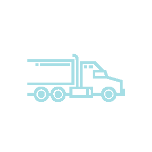

  

<h3 align="center">Courier Services</h3>

---

Road cargo transport system mobile applications (driver, client)

## 📝 Table of Contents

- [About](#about)
- [Getting Started](#getting_started)
- [Usage](#usage)
- [Built Using](#built_using)

## 🧐 About 

 
Courier Services contain two mobile application that facilitate management and transportation of road cargo transport.
      

 
The application is aimed at linking transport service providers:

- trucks
- motobikes
- bicycles
- taxi
- and private car owners

with clients who wish to move goods from one location to another.
 

The project contain two applications:

- driver application
- client application

### Driver application

> Allow driver to:
>
> - create account and login
> - create and update their profile
> - receive and confirm shipament orders
> - create and update vehicle information
> - view shipment history

### Client application

> Allow client to:
>
> - create account and login
> - create and update their profile
> - create shipament orders
> - make shipment payment
> - view shipment history

## 🏁 Getting Started 

This project is a starting point for a Flutter application.

A few resources to get you started if this is your first Flutter project:

- [Lab: Write your first Flutter app](https://flutter.dev/docs/get-started/codelab)
- [Cookbook: Useful Flutter samples](https://flutter.dev/docs/cookbook)

For help getting started with Flutter, view our
[online documentation](https://flutter.dev/docs), which offers tutorials,
samples, guidance on mobile development, and a full API reference.

## ⛏️ Built Using 

- [Flutter](https://flutter.dev/docs)

## 🎈 Usage 

### Installing

To install the android applications:

- Download the driver applications [driver](android_apk/driver.apk)
- Download the client applications [client](android_apk/client.apk)

